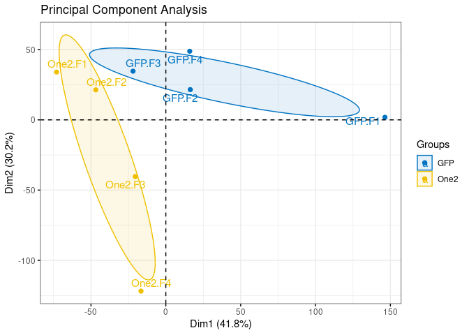
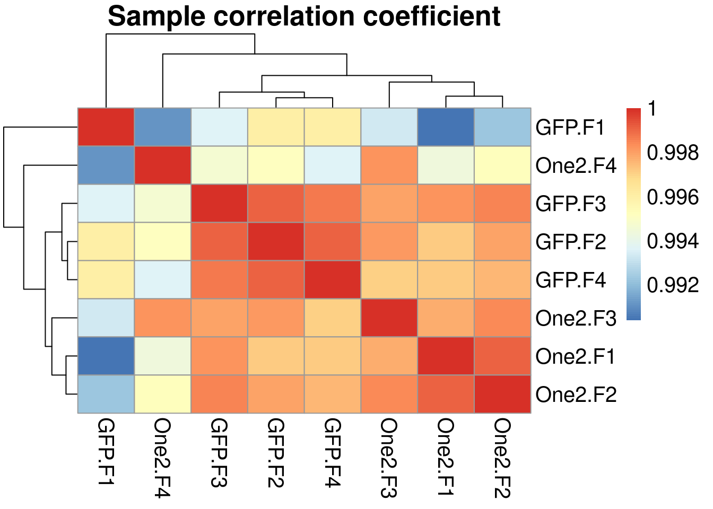
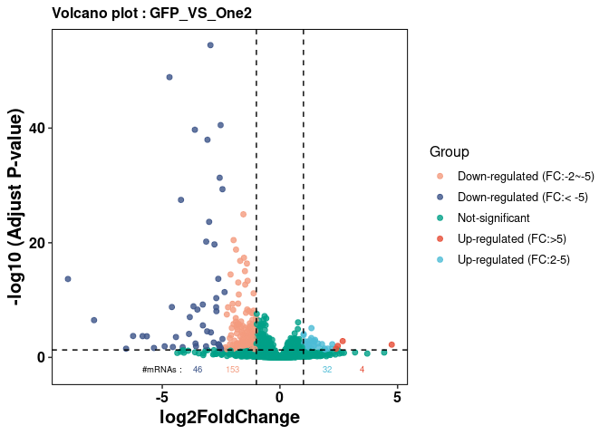
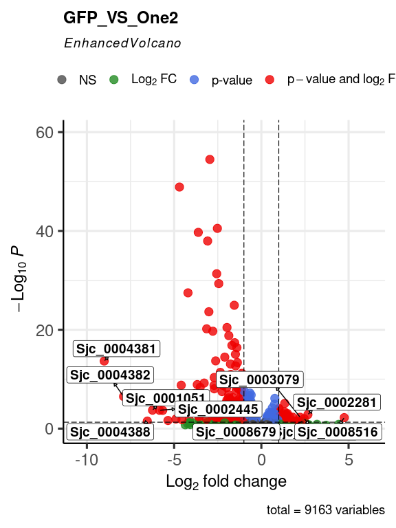
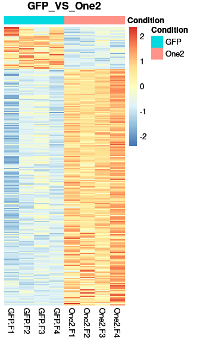
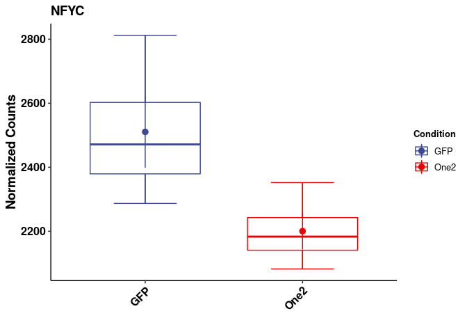
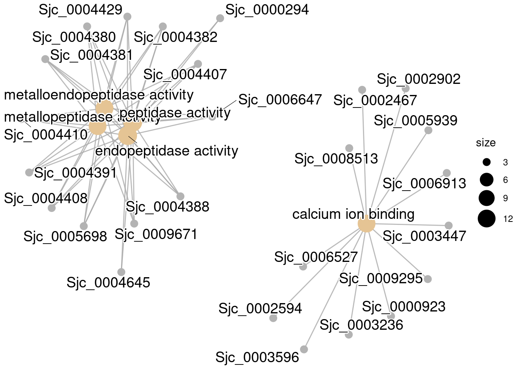
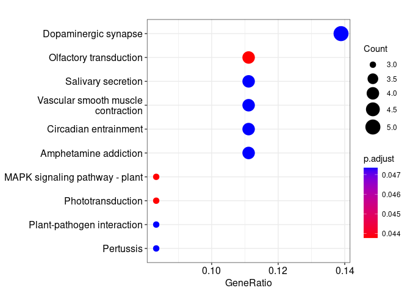

<!-- README.md is generated from README.Rmd. Please edit that file -->

# SJDB

<!-- badges: start -->
<!-- badges: end -->

SJDB is a R package of run RNA-seq DEGs analysis for Schistosoma
japonicum

## Installation

You can install the development version of SJDB like so:

``` r
install.packages('SJDB/',repos = NULL)
```

## Example

This is a basic example which shows you how to solve a common problem:

``` r
library(SJDB)
# If you want to do GO and KEGG pathway analysis for Schistosoma joponicum,you must install org.Sjaponicum.eg.db firstly,like this:

# install.packages(paste0(system.file("extdata",package = "SJDB"),"/org.Sjaponicum.eg.db"),repos = NULL)

library(org.Sjaponicum.eg.db)
#> Loading required package: AnnotationDbi
#> Loading required package: stats4
#> Loading required package: BiocGenerics
#> 
#> Attaching package: 'BiocGenerics'
#> The following objects are masked from 'package:stats':
#> 
#>     IQR, mad, sd, var, xtabs
#> The following objects are masked from 'package:base':
#> 
#>     anyDuplicated, append, as.data.frame, basename, cbind, colnames,
#>     dirname, do.call, duplicated, eval, evalq, Filter, Find, get, grep,
#>     grepl, intersect, is.unsorted, lapply, Map, mapply, match, mget,
#>     order, paste, pmax, pmax.int, pmin, pmin.int, Position, rank,
#>     rbind, Reduce, rownames, sapply, setdiff, sort, table, tapply,
#>     union, unique, unsplit, which.max, which.min
#> Loading required package: Biobase
#> Welcome to Bioconductor
#> 
#>     Vignettes contain introductory material; view with
#>     'browseVignettes()'. To cite Bioconductor, see
#>     'citation("Biobase")', and for packages 'citation("pkgname")'.
#> Loading required package: IRanges
#> Loading required package: S4Vectors
#> 
#> Attaching package: 'S4Vectors'
#> The following objects are masked from 'package:base':
#> 
#>     expand.grid, I, unname
#> 
## basic example code
```

### Step1.run different expression analysis and get a dds object

    #> estimating size factors
    #> estimating dispersions
    #> gene-wise dispersion estimates
    #> mean-dispersion relationship
    #> final dispersion estimates
    #> fitting model and testing

### Step2.PCA and Sample Correlation Analysis(pearson)

If you want to save plots,just set
`save_Plot = T, file_Dir = 'your_path/'`





### Step3.Get the DEGs(different expression genes) you want

### Step4.Heatmap and volcano plot



optional



    #> [1] "DE Genes Heatmap Plot Finish"





### Step5.GO / KEGG pathway enrichment analysis ps: optional,not required





### Step6.Write results to excel files

    #> [1] "GFP_VS_One2_AllGenes.xlsx"           "GFP_VS_One2_DEGenes.xlsx"           
    #> [3] "GFP_VS_One2_GOterms_enrichment.xlsx" "GFP_VS_One2_GSEA_GOterm.xlsx"       
    #> [5] "GFP_VS_One2_GSEA_KEGGpathway.xlsx"   "RNASeq_NormExpression.xlsx"
