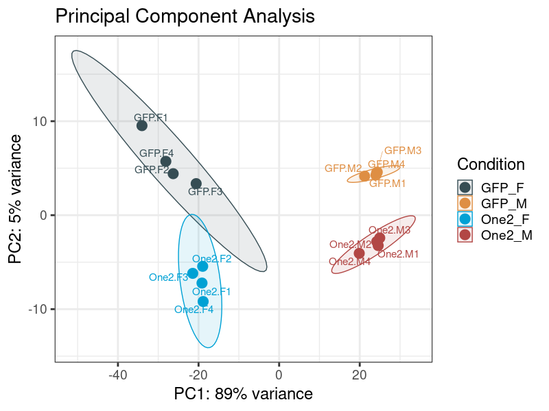
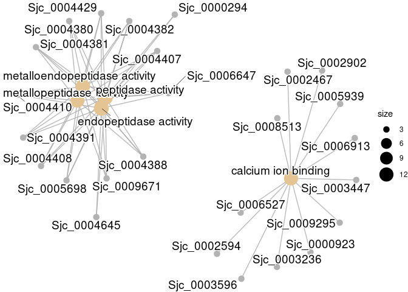

<!-- README.md is generated from README.Rmd. Please edit that file -->

# SJDB

<!-- badges: start -->
<!-- badges: end -->
SJDB is a R package used to perform  RNA-seq DEGs analysis in Schistosoma
japonicum

## Installation

You can install the development version of SJDB like so:

``` r
install.packages("remotes")
remotes::install_github('shycheng/SJDB')
```

## Example

This is a basic example which shows you how to solve a common problem:

``` r
library(SJDB)
# If you want to do GO and KEGG pathway analysis for Schistosoma joponicum,you must download <SJDB_Data> and install org.Sjaponicum.eg.db firstly,like this:

# install.packages("SJDB_Data/org.Sjaponicum.eg.db",repos = NULL)

# library all packages requried for analysi
library(org.Sjaponicum.eg.db)
library(writexl)
library(DESeq2)
library(clusterProfiler)
library(ggplot2)
library(FactoMineR)
library(factoextra)
library(patchwork)
library(ggpubr)
library(org.Sjaponicum.eg.db)
library(EnhancedVolcano)


#> Loading required package: AnnotationDbi
#> Loading required package: stats4
#> Loading required package: BiocGenerics
#> 
#> Attaching package: 'BiocGenerics'
#> The following objects are masked from 'package:stats':
#> 
#>     IQR, mad, sd, var, xtabs
#> The following objects are masked from 'package:base':
#> 
#>     anyDuplicated, append, as.data.frame, basename, cbind, colnames,
#>     dirname, do.call, duplicated, eval, evalq, Filter, Find, get, grep,
#>     grepl, intersect, is.unsorted, lapply, Map, mapply, match, mget,
#>     order, paste, pmax, pmax.int, pmin, pmin.int, Position, rank,
#>     rbind, Reduce, rownames, sapply, setdiff, sort, table, tapply,
#>     union, unique, unsplit, which.max, which.min
#> Loading required package: Biobase
#> Welcome to Bioconductor
#> 
#>     Vignettes contain introductory material; view with
#>     'browseVignettes()'. To cite Bioconductor, see
#>     'citation("Biobase")', and for packages 'citation("pkgname")'.
#> Loading required package: IRanges
#> Loading required package: S4Vectors
#> 
#> Attaching package: 'S4Vectors'
#> The following objects are masked from 'package:base':
#> 
#>     expand.grid, I, unname
#> 
## basic example code
```

### Step1.run different expression analysis and get a dds object

``` r
# If you are not sure about the sample name,Please use the following command to view
count_data <- read.table('~/Projects/RNASeq_YC_20220810/2.Results/SnakePipe_outputs/featureCounts/counts.tsv',header = T)
head(count_data)

# If you want to analyze multiple groups at once，Just add the group name and sample name repeatedly，like group_c_name ="xxx", group_c_samples="xxx",
dds <- run_DESeq2(count_data = '~/Projects/RNASeq_YC_20220810/2.Results/SnakePipe_outputs/featureCounts/counts.tsv',group_a_name = 'GFP',group_a_samples = c("GFP.F1", "GFP.F2", "GFP.F3", "GFP.F4"),group_b_name = 'One2',group_b_samples = c("One2.F1", "One2.F2", "One2.F3", "One2.F4"))
#> estimating size factors
#> estimating dispersions
#> gene-wise dispersion estimates
#> mean-dispersion relationship
#> final dispersion estimates
#> fitting model and testing

# ,save_Plot = T,file_Dir = '~/Projects/RNASeq_YC_20220810/2.Results/test/',p_cutoff = 0.05,FC_cutoff = 1
```

### Step2.PCA and Sample Correlation Analysis(pearson)

If you want to save plots,just set
`save_Plot = T, file_Dir = 'your_path/'`

``` r
plot_PCA(dds,save_Plot = T,file_Dir = '~/Projects/RNASeq_YC_20220810/2.Results/test/')
```



``` r
Plot_corr_heatmap(dds,savePlot = T,fileDir = '~/Projects/RNASeq_YC_20220810/2.Results/test/',type = 'pearson')
```


### Step3.Get the DEGs(different expression genes) you want

``` r
diffres <- get_mRNA_diff(dds,x= 'GFP',y = 'One2',p_cutoff = 0.05,FC_cutoff = 1)
```

### Step4.Heatmap and volcano plot

``` r
Plot_volcano(Diff_res = diffres,Dir = '~/Projects/RNASeq_YC_20220810/2.Results/test/',save_Plot = T )
```


optional

``` r
Plot_enhancedVolcano(Diff_res = diffres,n = 5,save_Plot = T,p_cutoff = 0.05,FC_cutoff = 1,Dir ='~/Projects/RNASeq_YC_20220810/2.Results/test/' )
```


``` r
Plot_heatmap(Diff_res = diffres,dds = dds,Dir = '~/Projects/RNASeq_YC_20220810/2.Results/test/',
             save_Plot = T,show_rownames = F)
#> [1] "DE Genes Heatmap Plot Finish"
```


``` r
Barplot_ID(dds = dds,ID = 'Sjc_0003510')
```


### Step5.GO / KEGG pathway enrichment analysis ps: optional,not required

``` r
GOres <- getGO(diffres$down_gene$SYMBOL)
clusterProfiler::cnetplot(GOres$GOList$MF) # BP,CC,MF
```



``` r
KEGGres <- getKEGG(diffres$down_gene$SYMBOL)
clusterProfiler::dotplot(KEGGres)
```


``` r
Plot_DE_GOTerms(Diff_res = diffres,DIR = '~/Projects/RNASeq_YC_20220810/2.Results/test/',p_cutoff = 0.05)
```

### Step6.Write results to excel files

``` r
ExptoXlSX(dds = dds,Dir = '~/Projects/RNASeq_YC_20220810/2.Results/test/')
DEtoXlSX(Diff_res = diffres,Dir = '~/Projects/RNASeq_YC_20220810/2.Results/test/')
GOtoXlSX(Diff_res = diffres,Dir = '~/Projects/RNASeq_YC_20220810/2.Results/test/')
# GSEA analysis need long time,don't run in the example 
# GSEAtoXlSX(Diff_res = diffres,Dir = '~/Projects/RNASeq_YC_20220810/2.Results/test/',pvalueCutoff = 0.5)

list.files("~/Projects/RNASeq_YC_20220810/2.Results/test/",pattern = '*xlsx')
#> [1] "GFP_VS_One2_AllGenes.xlsx"           "GFP_VS_One2_DEGenes.xlsx"           
#> [3] "GFP_VS_One2_GOterms_enrichment.xlsx" "GFP_VS_One2_GSEA_GOterm.xlsx"       
#> [5] "GFP_VS_One2_GSEA_KEGGpathway.xlsx"   "RNASeq_NormExpression.xlsx"
```

### Step7.Inference of differential exon usage in RNA-Seq data
``` r
# run_DEXseq and save resultes
dxr <- run_DEXseq(group_a_name = 'AF',
                  group_b_name ='GF',
                  flattenedFile = list.files("/SJDB/DEXSeq.chr.gff$", full.names=TRUE), 
                  DEXres_path = '~/2.Results/DEXseq_outputs/',
                  nCores = 4,file_Dir = './',p_cutoff = 0.05,FC_cutoff=1)
                  
```

``` r
id = 'Sjc_0001120'

par(oma=c(3,3,3,3))
DEXSeq::plotDEXSeq(dxr, id, displayTranscripts=F, legend=TRUE,FDR = 0.1,
           cex.axis=1,cex=1.5, lwd=1.5,names = T)
title(main = paste(id,id2name[id,'Note']),outer = T)

```


### Step8.Identification of cell type specific DE genes
``` r
# loading single cell RNA-seq dataset and prefix,eg:
load('~/Projects/Rscripts_set/SingleCell_dataset/SingleCell_prefix.rda')

# input DEGs you want to plot, "diffres"  DEGs res from get_mRNA_diff() function,eg: up-regualted genes
input_IDs = gsub('_','-',diffres$up_gene$SYMBOL)

# Male-- 
scBubbHeat(shinycell_prefix = ShinyCell_prefix_male,inp = input_IDs ,
           inpH5 = '~/Projects/Rscripts_set/SingleCell_dataset/Male.h5', "Cell Type")

# Female-- 
# scBubbHeat(shinycell_prefix = ShinyCell_prefix_female,inp = input_IDs ,
           inpH5 = '~/Projects/Rscripts_set/SingleCell_dataset/Female.h5', "Cell Type")

```


